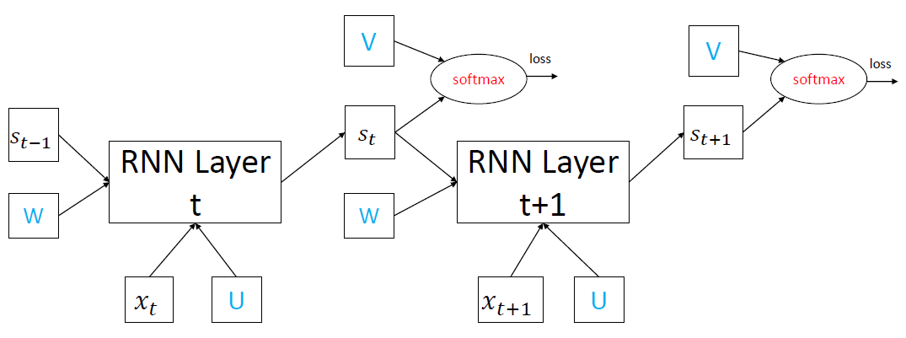

## fp_nn: Neural Networks built from first principles in NumPy.

### feedforward_nn
* Trains a feedforward neural network for classifying MNIST handwritten digits.
* MNIST data available at: [MNIST Database](http://yann.lecun.com/exdb/mnist/)

### rnn
* Trains recurrent neural network for sentence completion/prediction using the
text of Leo Tolstoy's War and Peace.
* rnn.py inspired heavily by: [pangolulu/rnn-from-scratch](https://github.com/pangolulu/rnn-from-scratch)
* char-rnn.py is a clone of [karpathy/min-char-rnn.py](https://gist.github.com/karpathy/d4dee566867f8291f086) 
which tests min-char-rnn.py on the War and Peace data and adds more verbose 
documentation for my own benefit.
* My preferred RNN visualization is the following:

